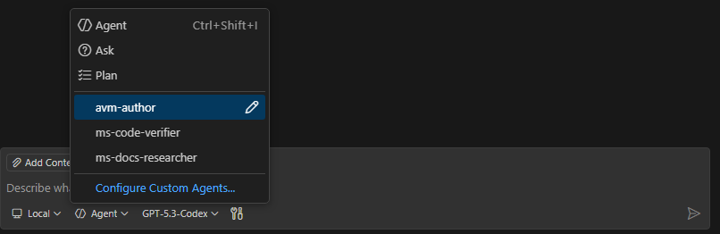

# 🎉 azops-agentic-infraops: Dual Agent Authoring for Azure Bicep

Welcome to a practical (and slightly less boring) way to do Azure InfraOps.

This repo demonstrates AVM-first Azure Bicep authoring with decision gates, secure defaults, and evidence capture. You get two agent paths that drive the same disciplined workflow:

- **Solution A:** GitHub Copilot agent artifacts under `.github/`
- **Solution B:** Codex skill artifacts under `.codex/`

Both solutions target the same endgame: documented service-option analysis, explicit option selection, policy-aligned Bicep authoring, and validation evidence.

Inspired by [azure-agentic-infraops](https://github.com/jonathan-vella/azure-agentic-infraops). This is a lightweight version with AzOps support.

## 🤖 What is agentic coding?

Agentic coding means the AI doesn’t just autocomplete lines, it follows a full workflow.
In this repo, agents gather required inputs, compare service options, enforce decision checkpoints, generate AVM-aligned Bicep, run validation checks, and record why each decision was made.
So instead of a single one-shot answer, you get repeatable infrastructure authoring with clear reasoning and verification.

## 🧑‍🚀 Agent roster (GitHub path)

- [avm-author.agent.md](.github/agents/avm-author.agent.md): Primary authoring agent. Enforces mandatory inputs and option gates, then writes AVM-first Bicep.
- [ms-docs-researcher.agent.md](.github/agents/ms-docs-researcher.agent.md): Research specialist. Pulls official Microsoft Learn evidence for service capabilities and options.
- [ms-code-verifier.agent.md](.github/agents/ms-code-verifier.agent.md): API verifier. Confirms Microsoft SDK/API names, signatures, and sample patterns.
- [bicep-authoring-validator.agent.md](.github/agents/bicep-authoring-validator.agent.md): Final quality gate. Performs strict pass/fail validation against repo rules.

## 🔁 Sequence we run things in

1. Start with `avm-author` to collect required inputs and constraints.
2. Run option analysis using Microsoft Learn evidence (typically via `ms-docs-researcher`).
3. Confirm explicit service option selections.
4. Author Bicep with `avm-author`.
5. Verify API details where needed with `ms-code-verifier`.
6. Validate everything with `bicep-authoring-validator` (must pass before finalizing).

## 📂 Project Structure

- [.github/copilot-instructions.md](.github/copilot-instructions.md): repository-wide behavior and mandatory gates
- [.github/agents/](.github/agents/): role-based Copilot agents (author, validator, docs researcher, code verifier)
- [.github/skills/bicep-avm-author/SKILL.md](.github/skills/bicep-avm-author/SKILL.md): canonical AVM authoring workflow and constraints
- [.codex/skills/](.codex/skills/): Codex skill equivalents
- [infra/](infra): generated infrastructure outputs and evidence

## 🟢 Path A: GitHub Copilot Agent Setup (`.github`)

### What it includes

- Always-on repository rules: [.github/copilot-instructions.md](.github/copilot-instructions.md)
- Specialized agents: [.github/agents/avm-author.agent.md](.github/agents/avm-author.agent.md), [.github/agents/bicep-authoring-validator.agent.md](.github/agents/bicep-authoring-validator.agent.md), [.github/agents/ms-docs-researcher.agent.md](.github/agents/ms-docs-researcher.agent.md), [.github/agents/ms-code-verifier.agent.md](.github/agents/ms-code-verifier.agent.md)
- Skill guidance under `.github/skills`

### Install and run

1. Install Visual Studio Code.
2. Install and sign in to GitHub Copilot in VS Code.
3. Clone the repository: `git clone https://github.com/Hardstl/azops-agentic-infraops.git`
4. Open the cloned `azops-agentic-infraops` folder in VS Code.
5. Ensure Copilot Chat/Agent mode can access workspace files.

6. Select the AVM authoring agent in Chat/Agent mode:

    

7. Prompt the agent to create a resource.

## 🟣 Path B: Codex Skill Setup (`.codex`)

### What it includes

- Codex skill definitions: [.codex/skills/bicep-avm-author/SKILL.md](.codex/skills/bicep-avm-author/SKILL.md)
- Supporting references under `.codex/skills/*/references`

### Install and run

1. Use a Codex-compatible coding agent/runtime that supports repository skill files under `.codex/skills`.
2. Open the cloned `azops-agentic-infraops` repository root in that runtime.
3. Ensure skill loading is enabled so `bicep-avm-author` and related skills are discoverable.
4. Start authoring tasks by invoking the Bicep AVM skill workflow and follow its mandatory option-analysis and input gates.
5. Run diagnostics/build/lint steps defined by the skill before considering output complete.

## 🧭 Using with AzOps

To use this directly in an existing AzOps repository, copy one skill system folder to the **root of your AzOps repo**:

- Copy `.github/` if you use GitHub Copilot in VS Code.
- Copy `.codex/` if you use a Codex-compatible runtime.

You usually only need one of these folders. Keeping one avoids conflicting instructions and keeps behavior predictable.

### Example (PowerShell)

From this repository root, copy either folder into your AzOps repo root:

- Copilot artifacts:
	- `Copy-Item -Path .github -Destination C:\path\to\your-azops-repo\.github -Recurse -Force`
- Codex artifacts:
	- `Copy-Item -Path .codex -Destination C:\path\to\your-azops-repo\.codex -Recurse -Force`

After copying, open your AzOps repo as the active workspace so the agent loads instructions from that repo root.

Also update AzOps path settings in the copied config file before authoring:

- If you copied `.github/`, edit `.github/skills/bicep-avm-author/references/azops-config.json`.
- If you copied `.codex/`, edit `.codex/skills/bicep-avm-author/references/azops-config.json`.

Set the path values in `azops-config.json` to match your actual AzOps repository structure.

## 🔌 MCP Server Configuration (Per Setup)

Authoritative inventory: MCP server list used by this repository setup.

### Required for both solutions

- `azure` — Azure operations and Azure best-practices tooling
- `microsoft_learn` — mandatory service-option research gate (`search` + `fetch`)
- `bicep` — AVM metadata, diagnostics, formatting, and Bicep quality tools

### Minimal MCP checklist

1. Configure MCP client connections for `azure`, `microsoft_learn`, and `bicep`.
2. Verify the tools are callable from your agent runtime.
3. Keep the MCP server inventory aligned with actual enabled servers.

## 🚦 Typical Authoring Flow (Both Setups)

1. Provide mandatory inputs and constraints.
2. Run service option analysis using Microsoft Learn tools.
3. Confirm explicit option selection per requested service.
4. Resolve AVM module choices and author Bicep.
5. Run diagnostics/build/lint.
6. Preserve authoring evidence with selected options and source links.

## 🚀 Standard Workflow: Prompt to Files

Start with this simple prompt:

```text
Create a function app and key vault with private endpoints and no public access.
```

What happens next:

1. **Input gate**: the agent asks for required inputs if missing (`location`, `projectName`, `environment`, `deploymentMode`, and AzOps target subscription/resource group for `azops` mode).
2. **Traffic and cost intake**: the agent asks for expected traffic/demand (`low`, `medium`, `high`, or `unknown`) and cost objective (`lowest-cost`, `balanced`, `performance-first`).
3. **Option analysis gate**: the agent researches options for Function App and Key Vault using Microsoft Learn tools and presents 2-3 viable options with one recommendation.
4. **Comparison table**: the agent builds a per-service comparison table so you can review cost profile, tradeoffs, and recommendation.
5. **Explicit confirmation**: the agent asks you to confirm the selected option for each service before authoring.
6. **Authoring**: after confirmation, the agent creates Bicep using AVM modules with private endpoints and disabled public access where supported.
7. **Validation**: the agent runs diagnostics/build/lint and fixes relevant issues.
8. **Evidence capture**: the agent records assumptions, selected options, tradeoffs, and source links.

Example options table:

| Service | Option (SKU/tier) | Cost profile | Why it satisfies constraints | Key tradeoff | Recommended (Yes/No) |
| --- | --- | --- | --- | --- | --- |
| Function App | Elastic Premium (EP1) | Medium (risk: higher idle cost than consumption) | Supports VNet integration + private endpoint for private-only access | Higher baseline cost vs Consumption | No |
| Function App | Flex Consumption (FC1) | Lower-Medium (risk: regional/runtime feature variance) | Can support private networking patterns with a lower baseline than EP plans | Not as predictable under sustained high load as EP plans | Yes |
| Function App | Consumption (Y1) | Lower (risk: cold start and scaling variability) | Lowest-cost path for light workloads; can still meet simple API/event workloads | Less predictable latency | No |
| Key Vault | Standard | Lower (risk: fewer premium crypto capabilities) | Meets private endpoint and RBAC requirements with public access disabled | No HSM-backed keys | Yes |
| Key Vault | Premium | Higher (risk: increased cost for unused advanced features) | Adds HSM-backed key support for stricter compliance scenarios | Higher cost | No |

Expected file outputs (under `infra/<projectName>/`):

- `main.<environment>.bicep`
- `main.<environment>.bicepparam`
- `authoring-evidence.md`

For AzOps mode, files are placed in the resolved AzOps target path according to repository rules.

